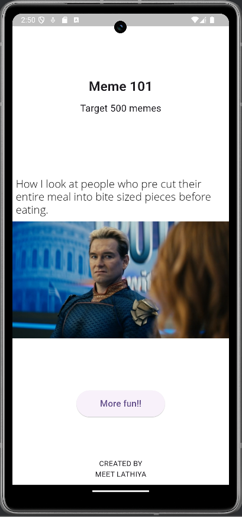

# RandomMeme Application

This repository contains the source code for **RandomMeme**, a Flutter-based mobile application designed to display random memes retrieved from an online API. The application is implemented using the Flutter framework and is compatible with Android, iOS, and web builds.

---

## 1. Purpose and Functionality

The application’s primary function is to retrieve and display memes from a public meme API. It includes the following operational features:

- **Splash Screen**: Displays a trollface graphic with the text *“Welcome!!”* upon launch.
- **Main Feed Screen**: Presents a meme title, the meme image, and a control element labeled *“More fun!!”* to retrieve additional memes.
- **Target Indicator**: Displays a subtitle *“Target 500 memes”* as a progress target.
- **Automatic Target Reset**: When the user achieves the target (e.g., views 500 memes), the application automatically resets the counter and sets a new target for continued engagement.
- **Footer Credit**: Static text indicating *“CREATED BY MEET LATHIYA”*.

---

## 2. Technical Stack

- **Framework**: Flutter (Dart language)
- **HTTP Requests**: `http` package for REST API calls
- **UI Components**: Material 3 design principles
- **Optional Dependencies**:
  - `cached_network_image` for image caching
  - `url_launcher` for opening original meme links

---

## 📸 Screenshots

| Splash Screen | Main Feed |
|---------------|-----------|
|  |  |

